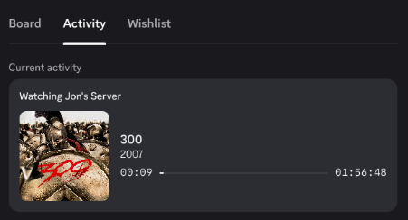
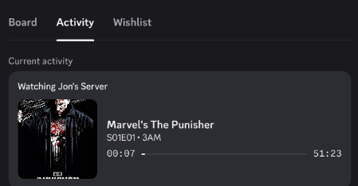
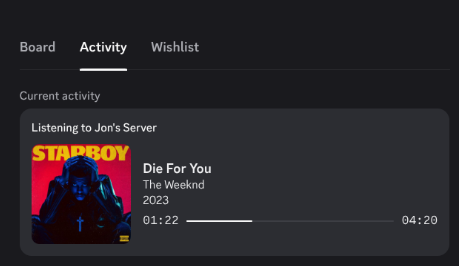

# Jellyfin Discord RPC
 
[](https://github.com/jsflorus/python-jellyfin-discord-rpc/actions)
[](https://ghcr.io/jsflorus/python-jellyfin-discord-rpc)
[](https://github.com/jsflorus/python-jellyfin-discord-rpc/releases)
---

Displays your Jellyfin playback status on Discord Rich Presence.

---

## ✨ Features

- Shows currently playing media from Jellyfin  
- Displays dynamic movie, TV show, and music artwork 
- Updates Discord Rich Presence in real time  
- Lightweight and Docker-friendly  
- Works with reverse proxy setups 

---
## Preview

### 🎬 Movies



### 📺 TV Shows



### 🎵 Music


---

## 📦 Requirements

- Jellyfin server  
- Discord (must be running on the host)  
- Docker (recommended)  

---

---
## 🎮 Discord Setup (Client ID + Assets)

Before running the app, you need to create a Discord application and configure assets.

### 1. Create a Discord Application

1. Go to https://discord.com/developers/applications  
2. Click **New Application**  
3. Give it a name (e.g., `Jellyfin RPC`)  
4. Click **Create**

---

### 2. Get Your Client ID

1. Inside your application dashboard  
2. Go to **General Information**  
3. Copy the **Application ID**

➡️ This is your `DISCORD_CLIENT_ID`

---

No Rich Presence assets are required. Artwork is pulled directly from Jellyfin.


---

### 4. Notes

- Rich Presence is enabled by default  
- No OAuth setup is required  

---
## 🚀 Quick Start (Docker)

```bash
docker run -d \
  --name jellyfin-rpc \
  --restart unless-stopped \
  --ipc host \
  --network host \
  --user 1000:1000 \
  -e DISCORD_CLIENT_ID=your_discord_client_id \
  -e JELLYFIN_URL=http://your-jellyfin \
  -e JELLYFIN_API_KEY=your_api_key \
  -e JELLYFIN_USER=your_username \
  -e DISCORD_UPDATE_INTERVAL_SECS=10 \
  -e XDG_RUNTIME_DIR=/run/user/1000 \
  -v /run/user/1000/.flatpak/com.discordapp.Discord/xdg-run:/run/user/1000 \
  ghcr.io/jsflorus/python-jellyfin-discord-rpc:latest
```

---

## 🐳 Docker Compose

```yaml
services:
  jellyfin-rpc:
    image: ghcr.io/jsflorus/python-jellyfin-discord-rpc:latest
    container_name: jellyfin-rpc
    restart: unless-stopped

    env_file:
      - .env

    environment:
      XDG_RUNTIME_DIR: /run/user/1000

    volumes:
      - /run/user/1000/.flatpak/com.discordapp.Discord/xdg-run:/run/user/1000

    network_mode: host
    user: "1000:1000"
```

---

## ⚙️ Environment Variables

| Variable | Description |
|----------|------------|
| DISCORD_CLIENT_ID | Discord application client ID |
| JELLYFIN_URL | URL of your Jellyfin server |
| JELLYFIN_API_KEY | Jellyfin API key |
| JELLYFIN_USER | Username to track |
| DISCORD_UPDATE_INTERVAL_SECS | Update interval in seconds |

---

## 📄 Example `.env`

```env
DISCORD_CLIENT_ID=123456789
JELLYFIN_URL=https://jellyfin.example
JELLYFIN_API_KEY=your_api_key_here
JELLYFIN_USER=JohnDoe
DISCORD_UPDATE_INTERVAL_SECS=10
```
----

## 🧠 How it works

The application polls the Jellyfin Sessions API and updates Discord Rich Presence using Discord IPC.

Artwork and media information is retrieved directly from Jellyfin and displayed in Rich Presence. Media information is updated automatically without requiring manually uploaded Discord assets.

---

## Important (Linux + Flatpak Discord)

If you're using Flatpak Discord, you **must mount the runtime directory**:

```yaml
volumes:
  - /run/user/1000/.flatpak/com.discordapp.Discord/xdg-run:/run/user/1000
```

Otherwise you will get:

```text
Discord RPC unavailable: Could not find Discord installed and running
```

---

## 🛠 Troubleshooting

### Discord not detected

* Make sure Discord is running
* Verify socket exists:

```bash
ls /run/user/1000/.flatpak/com.discordapp.Discord/xdg-run
```

You should see:

```text
discord-ipc-0
```

---

### Container restarts constantly

```bash
docker logs jellyfin-rpc
```

---

### Wrong DNS / cannot reach Jellyfin

* Ensure correct DNS or reverse proxy routing

---

## ⚠️ Known Limitations

### Delayed Detection During Automatic Music Playback

When Jellyfin automatically advances to the next track, the Sessions API may temporarily report no active media.

As a result, Discord Rich Presence updates may be delayed for approximately 30–40 seconds after a new song begins playing.

This behavior originates from Jellyfin's Sessions API and is not currently fixable from the client side.

The application automatically recovers once Jellyfin begins reporting the active track again.

Movies and TV episodes are generally unaffected.

---
## 📄 License

MIT
